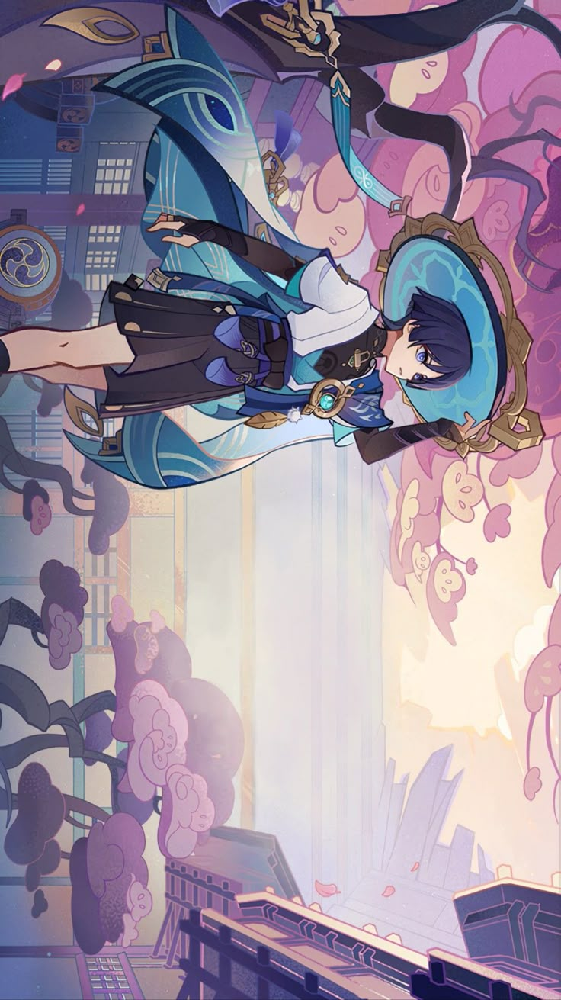

<pre style="background-color: #1A2B42; padding: 10px; border-radius: 5px; color: #E5F0FA;">
██████╗ ██╗       █████╗ ██████╗ ██╗██████╗ 
██╔══██╗██║     ██╔══██╗██╔════╝ ██║██╔══██╗
██████╔╝██║     ███████║██║      ██║██║  ██║
██╔═══╝ ██║     ██╔══██║██║      ██║██║  ██║
██║     ███████╗██║  ██║╚██████╗ ██║██████╔╝
╚═╝     ╚══════╝╚═╝  ╚═╝ ╚═════╝ ╚═╝╚═════╝ 
</pre>

## **Hello!** I am Andrey Placid - Python backend developer

Skills

  

 

### [Telegram](https://t.me/amvao) | [Email](mailto:amerfoe@gmail.com)

